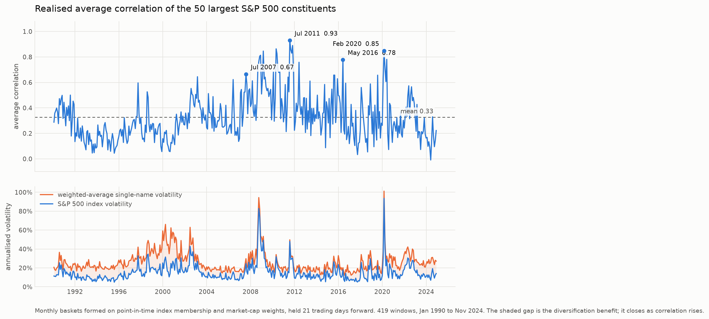
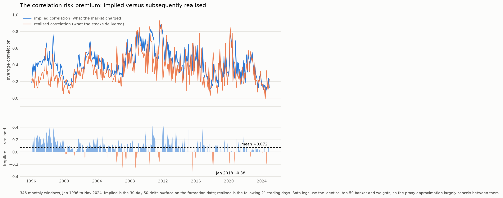
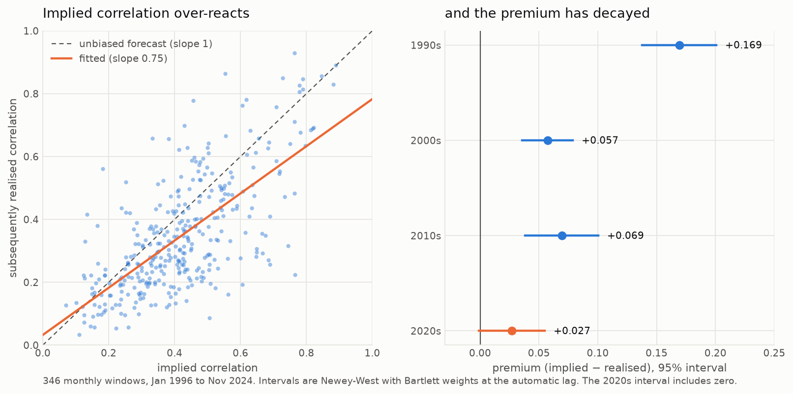
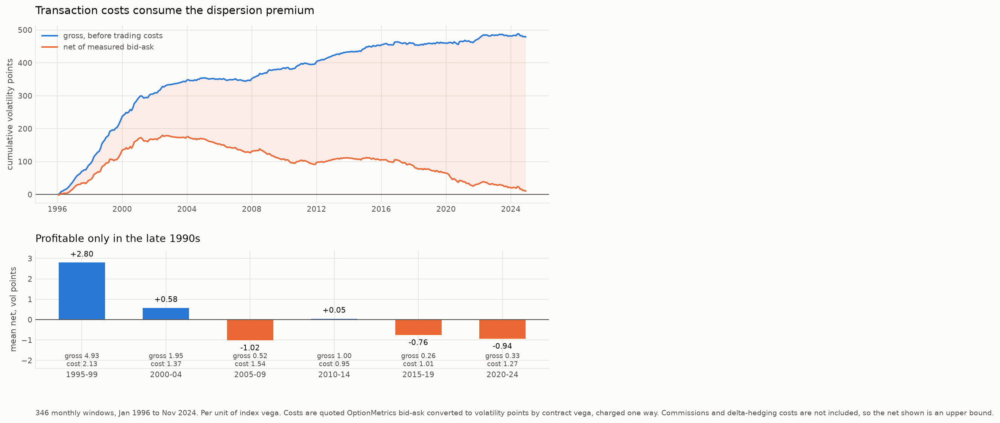

# Dispersion

Index implied volatility trades persistently above the weighted average of its constituents'
implied volatilities. That gap is the market's price for **correlation**, and it is tradeable:
sell index volatility, buy vega-weighted single-name volatility, and profit when the constituents
realise less correlation than was priced.

This repository measures that price, asks whether it is systematically too high, builds the
position that harvests it, and then examines what happens in the periods where the trade
famously breaks.

> **Status:** rungs 1-5 complete. Rung 6 (the tail) next.

## The build order

Each rung is completed, tested and committed before the next begins.

| Rung | | Status |
| --- | --- | --- |
| 1 | The variance identity, solved for average correlation | ✅ |
| 2 | Realised correlation from CRSP returns | ✅ |
| 3 | Implied correlation from the OptionMetrics surface | ✅ |
| 4 | The premium: implied versus subsequently realised | ✅ |
| 5 | The position: vega-weighted straddles, delta hedging, costs | ✅ |
| 6 | The tail: February 2018, March 2020 | |

## Rung 1 — the identity

An index is a weighted basket, so its variance is a weighted double sum over the covariance
matrix of its constituents:

```
σ²_I  =  Σᵢ wᵢ²σᵢ²  +  Σᵢ≠ⱼ wᵢwⱼ ρᵢⱼ σᵢσⱼ
```

That is exact. The single modelling step in this project is to replace every pairwise `ρᵢⱼ` with
one average correlation `ρ̄` and solve for it. Writing `A = Σ wᵢσᵢ` and `B = Σ wᵢ²σᵢ²`:

```
ρ̄  =  (σ²_I − B) / (A² − B)
```

Feed it implied volatilities and you get implied correlation — what the options market charges for
correlation. Feed it realised volatilities and you get what the stocks actually did. Dispersion is
short the first and long the second.

The approximation is **exact** whenever the pairwise correlations are homogeneous; all of its error
comes from dispersion in the `ρᵢⱼ` themselves. `ρ̄` is a genuine weighted average of the pairwise
correlations, so it can never fall outside their range. Both facts are asserted in the tests.

## Rung 2 — realised correlation

The same identity, applied to a rolling window of daily returns, gives a history of how correlated
the index members actually were.

Two measurement choices are worth stating, because both have consequences.

**Volatilities are not demeaned.** Realised volatility is computed as `√(mean(r²)·252)` rather than
as a sample standard deviation. Over a 21-day window the mean daily return is almost pure noise, so
subtracting it adds variance to the estimator. More importantly, implied volatility is a pure
second-moment quantity — an option price says nothing about drift — and rung 4 compares the two
directly. Demeaning one side and not the other would be a silent mismatch. This is also what
variance swaps pay on.

**The index return is the real index, not a reconstruction.** Building the index from its own
constituents makes the identity hold by construction, which proves the code is right but measures
nothing. The genuine measurement uses the actual index series and reports the basis between the two
as a diagnostic. Rung 3 compares against SPX options, so the index leg has to be the real index.

The non-demeaning choice has a convenient consequence that the test suite exploits: when the index
is reconstructed from its constituents, the identity holds **exactly** on sample moments, because
the matrix of non-demeaned second moments *is* a covariance matrix. That gives a zero-tolerance
correctness test on the whole pipeline rather than one that has to allow for sampling error.

## What rung 2 found



419 monthly windows, January 1990 to November 2024. Baskets of the 50 largest S&P 500 constituents
formed on point-in-time membership and market-cap weights, held 21 trading days forward.

| decade | windows | mean ρ | max ρ | mean single-name vol | mean index vol | mean basis |
| --- | --- | --- | --- | --- | --- | --- |
| 1990s | 120 | 0.234 | 0.596 | 26.1% | 13.1% | −0.011 |
| 2000s | 120 | 0.369 | 0.846 | 30.5% | 18.9% | −0.000 |
| 2010s | 120 | 0.385 | 0.930 | 20.5% | 13.2% | +0.001 |
| 2020s | 59 | 0.301 | 0.849 | 29.9% | 17.8% | −0.018 |

Three things worth stating.

**Correlation is not volatility.** The highest realised correlation in thirty-five years was July
2011 at 0.93 — the US debt-ceiling standoff and the European sovereign crisis — not March 2020,
which reached 0.85 at roughly twice the volatility. A dispersion book can be destroyed by a
correlation event that barely registers as a volatility event.

**The diversification benefit closes exactly when it is needed.** In the window formed 2019-11-29,
average single-name volatility was 14.0% against 7.8% for the index. In the window formed
2020-02-28, single-name volatility rose 7.2× to 101.2% while index volatility rose 12.0× to 93.5%.
The leg a dispersion seller is short moved further than the leg they are long, because correlation
tripled on top of the volatility move. That asymmetry is the trade's entire risk.

**Average correlation rose across the sample**, from 0.234 in the 1990s to 0.385 in the 2010s. Any
claim at rung 4 about a correlation premium has to contend with the fact that the quantity being
predicted is not stationary over this period.

## How rung 2 was verified

**The lookahead bias was measured, not assumed.** Re-forming each basket at the *end* of its window
rather than the start — which is what using today's membership to measure last month's volatility
amounts to — raises mean correlation by +0.0038 across a 53-month block spanning 2008–2012, in
53 of 53 windows, and drops the incomplete-name count from 3 to 1. Small, systematically positive,
present in every window, and it conceals the names that vanished. This repository forms at the
start.

**A single window is noisier than it looks.** The 21-day correlation estimate for the window formed
2010-04-30 is 0.864 with a bootstrap standard error of 0.065 and a 95% interval of [0.707, 0.964]
(2,000 resamples, 50 names). No claim at rung 4 can rest on one window, and a regression of
realised on implied correlation inherits that noise in its residuals.

**The formula matches Cboe's published methodology**, verified against the COR3M white paper
v1.0.5: the index is the difference between SPX implied variance and "the implied variance of an
uncorrelated portfolio of the top 50 SPX components by market capitalization", divided by "the sum
of pairwise weighted implied volatility products". Diagonal term included — the detail most
informal write-ups drop. One step could not be read from the paper (an image) and is resolved
numerically at rung 3 against published COR1M values.

**Coverage is complete.** 419 windows for 419 available month-ends; zero skipped. Only 17 windows
lost any constituent at all, never more than two.

## Rung 3 — what the market charged



Implied correlation comes from OptionMetrics' standardised volatility surface at **30 calendar
days, 50 delta** — Cboe's at-the-money convention, and a tenor chosen to match the realised
window, since 21 trading days is about 30 calendar days. Comparing a one-month forecast against a
two-week outcome would be a horizon mismatch, the same class of error as mixing price and total
returns at rung 2.

Both legs are priced off the **identical basket**: the same top-50 names, the same market-cap
weights, the same formation date. Only the volatilities differ. That matters, because it means the
top-50 proxy approximation largely cancels between the two sides instead of sitting between them as
an unmeasured wedge.

Constituents are mapped to OptionMetrics by the WRDS link table at `score = 1` only. Checked at
seven dates spanning 1996–2023: that threshold covers all 50 basket names every time, so the strict
setting costs no coverage.

| | |
| --- | --- |
| windows with both legs | 346 (Jan 1996 – Nov 2024) |
| mean implied correlation | 0.418 |
| mean realised correlation | 0.346 |
| **mean premium** | **+0.072** |
| premium positive in | **72.3%** of windows |

**The market charges more for correlation than correlation turns out to be**, by about 7
correlation points on average, in roughly three windows out of four. That is the premium a
dispersion seller is harvesting — and the more interesting fact about it is that it is mostly gone.

| decade | windows | implied | realised | premium | % positive |
| --- | --- | --- | --- | --- | --- |
| 1990s | 48 | 0.414 | 0.245 | **+0.169** | 92% |
| 2000s | 120 | 0.426 | 0.369 | +0.057 | 75% |
| 2010s | 120 | 0.454 | 0.385 | +0.069 | 68% |
| 2020s | 58 | 0.332 | 0.305 | +0.027 | 60% |

The edge was large and nearly automatic in the late 1990s and is a quarter of that size today, with
the hit rate falling from 92% to 60%. **This is the project's headline, not the +0.072.** A
correlation risk premium has been documented for twenty years; what a trading desk wants to know is
whether it is still there, and the answer on this evidence is: much less than it was. Any claim that
this is tradeable today has to clear a 0.027 premium net of costs on 51 option legs.

**The losses are concentrated and brutal.** The worst window was formed 2018-01-31 — the window
containing 5 February 2018, "Volmageddon". Implied correlation was 0.183; realised came in at
0.560. The market charged almost nothing for correlation and then got more than triple. The next
four worst are August 2015, the June 2016 Brexit vote, the May 2010 flash crash, and October 2018.
A short-correlation book earns small and steady and loses large and sudden, which is the shape the
decade table is averaging over.

## Rung 4 — does the premium survive inference



Correlation is persistent, so the premium series is serially correlated and an ordinary standard
error — which assumes independent observations — understates the uncertainty. Every figure below
uses a **Newey-West** standard error with Bartlett weights at the Newey-West (1994) automatic lag,
implemented directly rather than called from a library and checked against `statsmodels` in the
test suite.

**The premium is real.** Mean +0.0720, Newey-West standard error 0.0093 against a naive 0.0074 — a
1.25× inflation at 5 lags — giving **t = 7.74** where a naive calculation would claim 9.70.

**But implied correlation is a biased forecast, and not in the way you might assume.** The
Mincer-Zarnowitz regression `realised = α + β·implied`:

| | estimate | std error | test |
| --- | --- | --- | --- |
| α | +0.0324 | 0.0199 | t vs 0 = **+1.63** |
| β | +0.7505 | 0.0564 | t vs 1 = **−4.42** |

R² = 0.471. The intercept is **not** significantly different from zero, so this is not a constant
charge added to an otherwise accurate forecast. The slope is significantly below one: implied
correlation **over-reacts**. A one-point rise in implied forecasts only three-quarters of a point of
realised. The lines cross at an implied correlation of about 0.13, far below the sample average of
0.42, so in practice the premium *grows with the level of implied correlation*.

That is sharper than "there is a premium": the edge is conditional. Rung 5 tests whether that
conditionality is tradeable — and finds it is not, for reasons worth reading.

**The decay survives its own error bars.**

| decade | n | premium | 95% interval | t |
| --- | --- | --- | --- | --- |
| 1990s | 48 | +0.169 | [0.138, 0.201] | 10.5 |
| 2000s | 120 | +0.057 | [0.036, 0.079] | 5.2 |
| 2010s | 120 | +0.069 | [0.038, 0.101] | 4.4 |
| 2020s | 58 | +0.027 | **[−0.001, 0.055]** | 1.9 |

The 1990s interval does not overlap any later decade, so the decline is not an artefact of reading
point estimates off a table. And the 2020s interval **includes zero**: on this evidence the
correlation risk premium of the last five years is not statistically distinguishable from nothing,
before a single transaction cost has been charged against it.

### A measurement-error distinction that is easy to get backwards

Rung 2 established that a 21-day realised correlation carries a standard error of about 0.065. That
noise sits in the *dependent* variable of the regression above, where it inflates residual variance
and lowers R² but leaves β **unbiased**. Attenuation of β towards zero would require noise in the
*regressor* — the implied side, from surface interpolation and stale quotes — which is a smaller and
separate problem. Conflating the two would turn a real over-reaction result into a measurement
artefact, or hide one.

### Data limitations

OptionMetrics begins in 1996, so rungs 3–4 run on a shorter sample than rung 2's 1990 start. SPX
carries a surface row with a null implied volatility on 17 of 7,463 trading days (0.23%); those
windows keep their realised measurement and lose only the implied leg, and the omission is
reported rather than silently filled.

## Rung 5 — the position, and what it costs



Short one index straddle, long a straddle on each of the 50 names, vegas netted to zero. Everything
is quoted per unit of index vega in **volatility points**, which makes the P&L directly comparable
with a bid-ask spread measured the same way.

For an at-the-money straddle the delta-hedged P&L collapses to `vega × (σ_realised − σ_implied)`, so
per unit of index vega the trade earns the realised volatility spread minus the implied one.

### This is not the correlation premium

It is tempting to say the trade harvests what rung 4 measured. It does not. Over the sample the two
series correlate at only **+0.66** and disagree in sign in **20%** of windows. The decomposition
says why — of +1.385 volatility points of average gross P&L:

| leg | contribution |
| --- | --- |
| short index (VRP captured) | **+1.374** |
| long single names (VRP paid) | **+0.010** |

Single-name options are priced close to fair on average; index options are rich. **Vega-weighted
dispersion is overwhelmingly a short index volatility-risk-premium trade**, with the single-name leg
acting as a hedge that is roughly free but absorbs the volatility-level risk. A study that assumed
the P&L was the correlation premium would attribute the result to the wrong exposure.

### Costs are measured, not assumed

Quoted OptionMetrics bid-ask, converted to volatility points by each contract's own vega. A
straddle's spread in vol points equals a single option's — the call and put double both the dollar
spread and the vega, and the factors cancel.

| | mean, vol points | Newey-West t |
| --- | --- | --- |
| gross | +1.385 | +5.48 |
| cost | −1.355 | 15.86 |
| **net** | **+0.030** | **+0.14** |

**Transaction costs consume 98% of the gross P&L.** Sharpe 0.04 ± 0.19, hit rate 44%, worst month
−7.54, maximum drawdown −169 volatility points against a lifetime total of +10.4. A bootstrap
interval for the mean net P&L is [−0.26, +0.32].

| era | gross | cost | net |
| --- | --- | --- | --- |
| 1995-99 | 4.93 | 2.13 | **+2.80** |
| 2000-04 | 1.95 | 1.37 | +0.58 |
| 2005-09 | 0.52 | 1.54 | −1.02 |
| 2010-14 | 1.00 | 0.95 | +0.05 |
| 2015-19 | 0.26 | 1.01 | −0.76 |
| 2020-24 | 0.33 | 1.27 | **−0.94** |

The trade worked in the late 1990s and has not covered its costs since.

### A lookahead bug the rigor pass found, and what it cost

Rung 4's finding that implied correlation over-reacts suggests trading only when it is high. The
first version selected the top quartile with a `quantile(0.75)` computed over the **whole sample** —
in 1996 nobody knew the 1996-2024 quartile.

| threshold | net | Sharpe |
| --- | --- | --- |
| full-sample (leaks) | +0.245 | +0.28 |
| expanding, shifted (honest) | **−0.266** | **−0.38** |

The entire apparent benefit of conditioning was the leak. Done honestly, conditioning makes the
strategy **worse**. The threshold is now built from history up to the previous observation only, and
a test asserts that truncating the series cannot change any earlier signal — the same no-lookahead
property rung 2's weights are held to.

Neither variant has a Sharpe distinguishable from zero: 0.04 ± 0.19 unconditional and −0.38 ± 0.39
conditional, using `se(SR) ≈ √((1 + ½·SR²)/T)`.

### Limitations

Stated because they all point the same way — the net above is an **upper bound**.

- **Commissions and exchange fees are not modelled**, and the trade touches 51 option legs monthly.
- **Delta-hedging costs are not modelled.** The P&L identity assumes continuous hedging; hedging the
  underlying over 21 days costs equity spread and commission.
- **Pre-2010, a median of 10 of 50 names have no two-sided quote** and are dropped from the cost
  calculation with the remaining weights renormalised. Those are the illiquid tail, so their spreads
  are wider than the ones measured — early-era costs are understated and early profits
  correspondingly overstated.
- **The cost tenor is not always 30 days.** Before weekly options, month-end formation dates had no
  25-35 day contract, so the nearest listed expiry is used (19-22 days early, 29 later). Shorter
  options carry less vega, so the same dollar spread converts to a larger vol-point cost — biasing
  early costs *up*, partly offsetting the previous point.
- **Returns are not normal**: skew +0.89, excess kurtosis +2.33, worst month −2.7σ. The bootstrap
  interval is quoted for that reason.
- **Two strategy variants were tried** — unconditional and conditional. Both are reported.

## Reproducing

Data comes from WRDS (CRSP, OptionMetrics) and is licensed, so no record-level data is committed
here. Reproducing the empirical rungs requires your own WRDS credentials; the queries used are
documented in the code.

```bash
uv sync
uv run pytest
```
