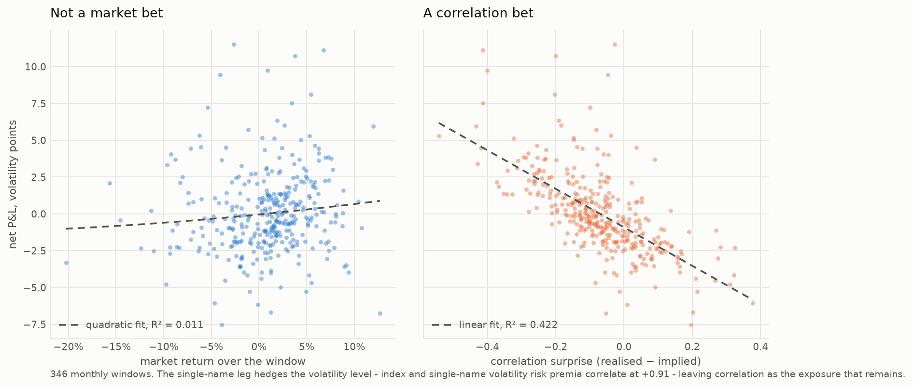

# Correlation risk premium

Options on the S&P 500 are expensive relative to options on the stocks inside it. The gap between
them is the price of correlation, and selling it is a standard trade called dispersion: short the
index straddle, long a straddle on each constituent.

This measures that price every month from 1990 to 2024, tests whether it was too high, builds the
trade that collects it, and charges the trade what it actually cost to execute.

The premium is real. Implied correlation averaged 0.418 against realised 0.346 across 346 monthly
windows. The market charged about seven correlation points more than correlation turned out to be,
and did so in 72% of months.

Most of it is gone. The premium was 0.169 in the 1990s and 0.027 since 2020, where its 95%
confidence interval includes zero.

The trade does not survive its own bid-ask. Gross profit averages 1.385 volatility points per unit
of index vega; the quoted spread costs 1.355. What is left is 0.030, with a t-statistic of 0.14.
The last period it reliably covered costs was the early 2000s.

## How correlation gets priced

An index is a weighted basket, so its variance is a double sum over the covariance matrix of its
members:

```
σ²_I  =  Σᵢ wᵢ²σᵢ²  +  Σᵢ≠ⱼ wᵢwⱼ ρᵢⱼ σᵢσⱼ
```

That is an identity, not a model. The problem is the second term: there are about 125,000 distinct
pairwise correlations in the S&P 500 and the market quotes none of them. The one modelling step in
this project is to replace them all with a single average ρ̄ and solve for it. Writing
`A = Σ wᵢσᵢ` for the weighted-average constituent volatility and `B = Σ wᵢ²σᵢ²` for the diagonal
term:

```
ρ̄  =  (σ²_I − B) / (A² − B)
```

Feed that implied volatilities and ρ̄ is the correlation the options market is charging for. Feed
it realised volatilities and ρ̄ is the correlation the stocks delivered. The difference between the
two is the premium.

This is the construction Cboe publishes its implied correlation indices from, checked against the
COR3M white paper: the numerator is SPX implied variance minus "the implied variance of an
uncorrelated portfolio of the top 50 SPX components by market capitalization", and the denominator
is "the sum of pairwise weighted implied volatility products". The diagonal term belongs in both,
which is the detail most informal write-ups drop.

Two properties make the approximation defensible rather than convenient. ρ̄ is a weighted average
of the pairwise correlations it replaces, so it can never fall outside their range. And it is
exactly right, not approximately, whenever those correlations are homogeneous, so all of its error
comes from how much they differ from each other. Both are asserted in the tests.

## The measurement

On the last trading day of each month, the basket is fixed: the 50 largest S&P 500 members by
market capitalisation, using membership and weights as they stood on that date. The basket is then
held for the following 21 trading days and volatility is measured over that forward window.

Forming the basket at the start and measuring forward is the only ordering with no lookahead.
Taking today's members and measuring their volatility over the past month silently conditions on
which names survived the month, and the size of that bias is measured here rather than assumed:
re-forming each basket at the end of its window instead raises measured correlation by 0.0038, in
53 of 53 windows across 2008 to 2012, and hides the names that disappeared.

The realised leg uses CRSP daily returns. The implied leg uses OptionMetrics' standardised
volatility surface at 30 calendar days and 50 delta, which is Cboe's at-the-money convention and
matches the horizon, since 21 trading days is about 30 calendar days. Costs come from quoted
bid-ask in the raw option file, converted into volatility points by each contract's own vega.

Several smaller choices have consequences, so they are worth naming.

Volatility is not demeaned. It is computed as `√(mean(r²)·252)` rather than as a sample standard
deviation. Over 21 days the mean daily return is close to noise, and an option price says nothing
about drift, so demeaning the realised side while the implied side cannot be demeaned would compare
two different quantities. This is also what variance swaps pay on. It has a useful side effect: the
matrix of non-demeaned second moments is itself a covariance matrix, so a basket reconstructed from
its own members satisfies the identity exactly, which turns the correctness check on the whole
pipeline into a zero-tolerance assertion.

Both legs use price returns. SPX options are written on the price index, so the index uses CRSP's
`sprtrn` and constituents use `retx` rather than `ret`. Mixing a total return with a price return
would bias the correlation.

The index volatility is the real index, not a reconstruction. Building the index from its own
constituents makes the identity hold by construction, which proves the code works but measures
nothing. The published measurement uses the actual S&P 500 series and reports the gap between the
two as a diagnostic.

Names with no usable data are dropped and the remaining weights renormalised, and the count is
published with every window. Dropping them is the only option when a volatility is undefined.
Dropping them quietly is how survivorship bias gets into a result that otherwise looks clean.

## Correlation, 1990 to 2024


419 monthly windows, January 1990 to November 2024, mean realised correlation 0.325.

| decade | windows | mean ρ | max ρ | mean single-name vol | mean index vol |
| --- | --- | --- | --- | --- | --- |
| 1990s | 120 | 0.234 | 0.596 | 26.1% | 13.1% |
| 2000s | 120 | 0.369 | 0.846 | 30.5% | 18.9% |
| 2010s | 120 | 0.385 | 0.930 | 20.5% | 13.2% |
| 2020s | 59 | 0.301 | 0.849 | 29.9% | 17.8% |

Correlation and volatility are different risks. The highest reading in thirty-five years was July
2011 at 0.93, during the US debt-ceiling standoff and the European sovereign crisis, not March 2020
at 0.85 with roughly twice the volatility.

The lower panel shows why that matters. The gap between the two lines is the diversification a
dispersion seller is short, and it closes exactly when it is needed. Into March 2020 single-name
volatility rose 7.2 times while index volatility rose 12.0 times, because correlation tripled on
top of the volatility move. The leg you are short moved further than the leg you are long.

## The premium


Both legs are priced off the same basket: same 50 names, same weights, same date, with only the
volatilities differing. That matters, because the top-50 proxy approximation then largely cancels
between the two sides instead of sitting between them as an unmeasured wedge.

Across 346 windows with both legs, implied correlation averaged 0.418 and subsequently realised
correlation 0.346, a premium of 0.072 that was positive in 72.3% of months.

Correlation is persistent, so the premium series is serially correlated and an ordinary standard
error understates the uncertainty. Newey-West with Bartlett weights widens it by a quarter, from
0.0074 to 0.0093, which still leaves a t-statistic of 7.74.


Regressing realised correlation on implied gives an intercept of 0.032, not distinguishable from
zero, and a slope of 0.751 with a t-statistic against one of −4.42. So this is not a constant charge
on top of an accurate forecast. Implied correlation over-reacts: a one-point rise in it forecasts
only three-quarters of a point of realised correlation. The two lines cross at an implied
correlation near 0.13, well below the sample average of 0.42, so in practice the premium grows with
the level of implied correlation.

The decline across decades survives its own error bars.

| decade | windows | premium | 95% interval |
| --- | --- | --- | --- |
| 1990s | 48 | 0.169 | 0.138 to 0.201 |
| 2000s | 120 | 0.057 | 0.036 to 0.079 |
| 2010s | 120 | 0.069 | 0.038 to 0.101 |
| 2020s | 58 | 0.027 | −0.001 to 0.055 |

The 1990s interval does not overlap any later decade, and the 2020s interval contains zero. On this
evidence the correlation risk premium of the last five years cannot be distinguished from nothing,
before any transaction cost is charged against it.

## Trading it


Short one index straddle, long a straddle on each of the 50 names, sized so the vegas net to zero.
Everything is quoted per unit of index vega in volatility points, which makes the P&L directly
comparable with a bid-ask spread measured the same way.

For an at-the-money straddle the delta-hedged P&L collapses to `vega × (σ_realised − σ_implied)`.
Applying that to both legs leaves the realised volatility spread minus the implied one.

Costs are measured, not assumed. A straddle's spread in volatility points equals a single option's,
because the call and the put double both the dollar spread and the vega and the two factors cancel.

| | mean, volatility points | t |
| --- | --- | --- |
| gross | 1.385 | 5.48 |
| cost | −1.355 | 15.86 |
| net | 0.030 | 0.14 |

The bid-ask consumes 98% of the gross. The Sharpe ratio is 0.04 with a standard error of 0.19, the
hit rate is 44%, the worst month is −7.54 and the maximum drawdown is −169 volatility points
against a lifetime total of 10.4. Returns are skewed and fat-tailed, so a bootstrap interval for the
mean is quoted too: −0.26 to 0.32.

| period | gross | cost | net |
| --- | --- | --- | --- |
| 1995-99 | 4.93 | 2.13 | 2.80 |
| 2000-04 | 1.95 | 1.37 | 0.58 |
| 2005-09 | 0.52 | 1.54 | −1.02 |
| 2010-14 | 1.00 | 0.95 | 0.05 |
| 2015-19 | 0.26 | 1.01 | −0.76 |
| 2020-24 | 0.33 | 1.27 | −0.94 |

Since the premium grows with implied correlation, trading only when implied correlation is high is
the obvious refinement. It does not work, and the way it appears to work is instructive. Choosing
the top quartile with a quantile computed over the whole sample gives a net of 0.245 and a Sharpe
of 0.28. Nobody in 1996 knew the 1996 to 2024 quartile. Recomputed with an expanding threshold that
only sees history, the same rule gives −0.266 and a Sharpe of −0.38. The entire improvement was the
lookahead. Conditioning honestly makes the strategy worse.

## The exposure



The obvious objection is that this is short volatility with extra steps. It is not, and the reason
is the point of the structure.

| exposure | R² |
| --- | --- |
| index volatility risk premium | 0.060 |
| market return and its square | 0.011 |
| correlation surprise | 0.422 |

The index volatility risk premium supplies almost the whole average P&L: of 1.385 volatility points
of gross, the short index leg contributes 1.374 and the long single-name leg 0.010. Single-name
options are priced close to fair on average and index options are rich.

But it explains only 6% of the month-to-month variation, because index and single-name volatility
risk premia correlate at 0.911. The single-name leg hedges away nearly all of the common volatility
level, and what survives is the difference between two nearly identical premia, which is
correlation. The slope on correlation surprise is −13.08 with a t-statistic of −14.0.

Market exposure is absent. The squared-return coefficient is 7.6 with a t-statistic of 0.16, so
there is no short-gamma signature. The quintile table agrees and assumes no functional form at all:
the worst bucket by mean P&L is the second, not the crash bucket, and the worst individual months
are scattered across every quintile.

So the hedge works. That vindicates the structure and at the same time explains why the net P&L is
small and noisy: what remains after hedging is a thin spread between two nearly identical
volatility risk premia.

### The losses are correlation events

| episode | formed | implied ρ | realised ρ | surprise | market | net P&L |
| --- | --- | --- | --- | --- | --- | --- |
| LTCM and Russia | 1998-07-31 | 0.455 | 0.526 | 0.07 | −14.6% | −0.42 |
| Lehman | 2008-09-30 | 0.606 | 0.762 | 0.16 | −20.3% | −3.32 |
| Euro crisis | 2011-07-29 | 0.764 | 0.930 | 0.17 | −6.4% | −2.52 |
| China devaluation | 2015-07-31 | 0.333 | 0.658 | 0.33 | −6.3% | −2.30 |
| Volmageddon | 2018-01-31 | 0.183 | 0.560 | 0.38 | −4.7% | −6.06 |
| Covid | 2020-02-28 | 0.728 | 0.849 | 0.12 | −11.1% | −2.53 |

Every one is a loss and in every one realised correlation exceeded implied. Read the last two
columns together: the worst month is February 2018, which had the mildest market decline of the
six. Lehman fell 20.3% and produced half the loss. Severity tracks the correlation surprise, not
the market move. A dispersion book is not destroyed by a crash. It is destroyed by correlation
going to one, which a crash usually causes but does not have to.

## Limitations

These all point the same way, so the net P&L above is an upper bound.

Commissions and exchange fees are not modelled, and the trade touches 51 option legs a month.
Delta-hedging costs are not modelled either; the P&L identity assumes continuous hedging, and
hedging the underlying for 21 days costs equity spread and commission.

Before 2010 a median of 10 of the 50 names have no two-sided option quote and are dropped from the
cost calculation. Those are the illiquid end of the basket, so their spreads are wider than the ones
that were measured, which means early costs are understated and early profits overstated. Pulling
the other way, the cost tenor in that period is 19 to 22 days rather than 30, because monthly-only
expiry cycles left nothing near 30 days from a month-end. Shorter options carry less vega, so the
same dollar spread converts into a larger cost in volatility points.

The sensitivity of the result to the top-50 universe, the 30-day tenor and the monthly window is
untested. Those were fixed in advance to match Cboe's convention and the measurement horizon, and
never varied, which rules out fishing but leaves robustness unknown.

Two strategy variants were tried, unconditional and conditional. Both are reported above.

## Running it

```bash
uv sync
uv run pytest                                   # 108 tests, no credentials needed
uv run dispersion-reproduce --username YOU      # rebuild from WRDS, then draw
uv run dispersion-reproduce --from-cache        # redraw from an existing panel
```

`dispersion-reproduce` prints every statistic quoted above, in the order it appears here, and
writes all five figures to `reports/`. No number in this file was typed by hand.

The test suite needs no subscription. Every fixture is synthetic, so the identity, the estimators
and the no-lookahead properties can be verified by anyone; only the empirical sections need WRDS.

Data comes from CRSP and OptionMetrics through WRDS and is licensed, so no record-level data is
committed here and the derived panel under `data/` is gitignored too. The tables, columns and
queries are documented in `data.py`. You need a WRDS account with CRSP and OptionMetrics
entitlements and a `.pgpass` file, which `db.create_pgpass_file()` writes once.

## Layout

| file | contents |
| --- | --- |
| `correlation.py` | the variance identity and the average-correlation solution |
| `realized.py` | volatility primitives shared by both measurements |
| `data.py` | WRDS access, point-in-time membership, weights, quoted spreads |
| `history.py` | the monthly driver that builds the panel |
| `inference.py` | Newey-West means and HAC regression |
| `strategy.py` | the position, its P&L and its costs |
| `tail.py` | exposure analysis and the episode table |
| `plots.py` | the five figures |
| `reproduce.py` | regenerates all of it |
